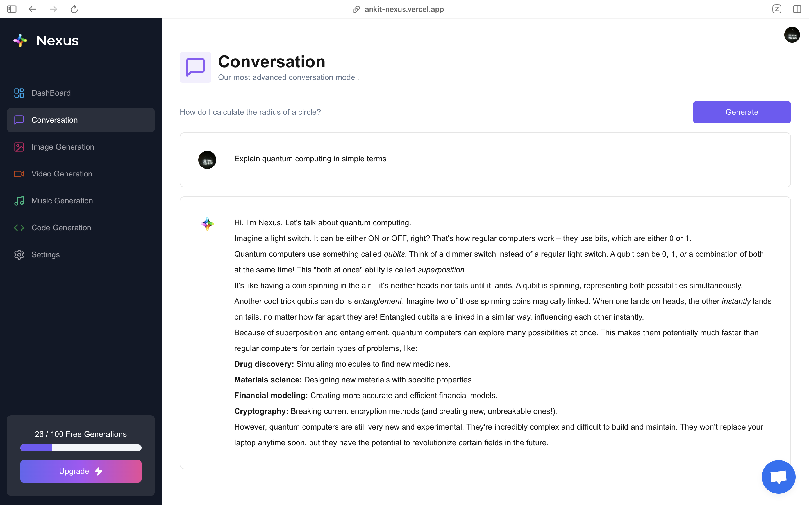

# Nexus AI Platform

Nexus is a modern AI SaaS platform that empowers users to generate code, images, music, and video using natural language prompts. Built with Next.js, TypeScript, and Tailwind CSS, Nexus integrates state-of-the-art AI models (Google Gemini, Leap AI, Replicate) and provides a seamless, secure, and scalable user experience.

## Features

- **Multi-Modal AI Generation:** Instantly create code snippets, images, music, and videos from text prompts.
- **Modern UI/UX:** Responsive, accessible design using Tailwind CSS, shadcn/ui, and Radix UI components.
- **Authentication & Access Control:** Secure sign-in and tiered access with Clerk.
- **Usage Metering:** Free and premium tiers with API usage tracking and rate limiting.
- **Real-Time Feedback:** Crisp chat integration, hot toast notifications, and user analytics.
- **Developer Experience:** Modular codebase, React Hook Form + Zod validation, and Prisma ORM.

## Technologies Used

- **Frontend:** Next.js 14, React 18, TypeScript, Tailwind CSS, shadcn/ui, Radix UI, Lucide Icons
- **Backend:** Custom Next.js API routes, Prisma ORM, PostgreSQL
- **AI Integrations:** Google Generative AI (Gemini), Leap AI, Replicate
- **Authentication:** Clerk
- **State Management:** Zustand

## Demo

[Live Demo](https://ankit-nexus.vercel.app/)

### Screenshots

---
